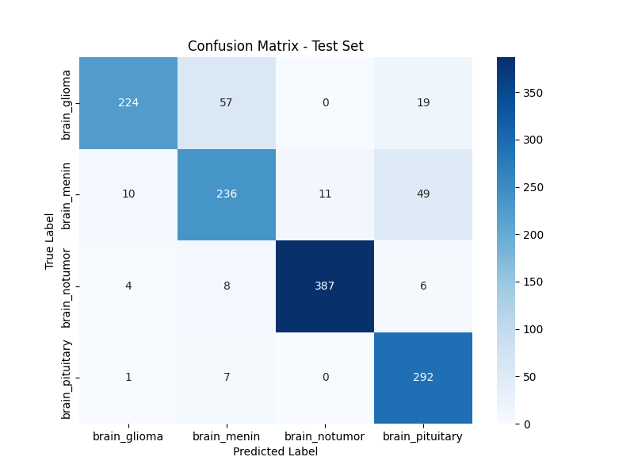

# CNN Framework for Multi-Class Brain Tumor Classification from Magnetic Resonance Imaging Data

<p align="center">
  <!-- Status & Activity -->
  
  <a href="https://www.tensorflow.org/"></a>
  <a href="https://keras.io/"></a>
  
  
<a href="LICENSE"></a>
  
</p>

<p align="center">


  

</p>

## Section 0: How to Use (Short and conscise)

- Download this dataset - [Brain Tumor MRI Dataset](https://www.kaggle.com/datasets/masoudnickparvar/brain-tumor-mri-dataset)

- add this dataset to BrainCancerPredictor/brain_cancer_project when you have cloned the repository 

- now run the following commands from `python -m brain_cancer_project.main test_data_load` while inside BrainCancerProject **NOT** in brain_cancer_project 


```bash
git clone https://github.com/AayushBadola/BrainCancerPredictor.git
```


```bash
cd BrainCancerPredictor
```


```bash
python -m venv venv 
```


```bash
./venv/Scripts/activate
```


```bash
pip install -r requirements.txt
```

```bash
python -m brain_cancer_project.preprocess_dataset
```

```bash
python -m brain_cancer_project.main test_data_load
```


```bash
python -m brain_cancer_project.main train
```


```bash
python -m brain_cancer_project.main evaluate
```


```bash
python -m brain_cancer_project.main predict --sample_predict
```
this predicts the image which is not used to train the model


**Note** Make SURE that for using custom image to predict, use the absolute path   "Absolute Path to Image" change it to "Path of your Custom Image".

```bash
python -m brain_cancer_project.main predict --image_path "Absolute Path to Image"  #Absolute path example :- C:\Users\Dell\Desktop\MRI_image.jpg
```


## Section I: Executive Abstract and Project Mandate

This repository serves as a definitive archive for a sophisticated deep learning system meticulously engineered for the automated classification of Magnetic Resonance Imaging (MRI) data pertaining to human brain tumors. The paramount objective of this initiative is the development and rigorous empirical validation of a computational model capable of achieving high-precision, reliable differentiation among three clinically significant neuropathological categories: **Glioma**, a heterogeneous group of primary brain tumors originating from glial cells, characterized by their infiltrative nature and varying degrees of malignancy; **Meningioma**, generally benign, slow-growing tumors arising from the arachnoid cap cells of the meninges, the protective membranes enveloping the brain and spinal cord; and a third, flexibly defined **Tumor** category. This latter category is designed to accommodate MRI scans representing either a specific distinct pathology (such as pituitary adenomas, aligning with certain comprehensive datasets) or a broader aggregation of other neoplastic entities, with its specific characterization being contingent upon the constitution of the user-provided imaging dataset.

The methodological core of this classification framework is a custom-designed Convolutional Neural Network (CNN). This neural architecture is predicated on the principle of hierarchical feature learning, wherein the network autonomously discovers and extracts increasingly abstract and discriminative visual patterns directly from the raw pixel intensity values of the input MRI slices. The comprehensive computational workflow, spanning initial data ingestion and meticulous preprocessing, through robust model training and optimization, to subsequent inferential analysis and performance evaluation, is orchestrated entirely within the **TensorFlow** ecosystem. TensorFlow, an open-source, end-to-end platform for machine learning developed by Google, provides the foundational tensor manipulation capabilities, automatic differentiation (via reverse-mode autodifferentiation, crucial for gradient-based learning through backpropagation), and seamless integration with hardware accelerators such as NVIDIA GPUs (leveraging CUDA and cuDNN) and Google TPUs. The **Keras API**, a high-level, developer-centric interface natively integrated within TensorFlow, is systematically employed for the declarative construction of the CNN architecture, its subsequent compilation with user-specified optimization algorithms and loss functions, and the efficient management of the iterative training process.

This project is offered as an open-source contribution intended to benefit the computational pathology, neuroradiology, and broader medical artificial intelligence research communities. It aspires to function as a robust, transparent, and extensible baseline system, facilitating further investigations into AI-augmented diagnostic methodologies. The provided codebase and documentation are structured to encourage peer review, collaborative refinement, exploration of alternative model architectures or training paradigms, and potential adaptation for integration into clinical research protocols or educational platforms. A steadfast commitment to methodological rigor, code clarity, detailed documentation, and experimental reproducibility underpins this endeavor, aiming to foster collaborative progress in this vital intersection of artificial intelligence and healthcare.

---

## Section II: Data Corpus Specification, Provenance, and Pre-processing Paradigms

The empirical foundation upon which the supervised learning model is trained, validated, and evaluated is the **"Brain Cancer - MRI dataset."** This dataset is a publicly accessible collection of medical images, diligently curated by Orvile and disseminated through the Kaggle data science competition and collaboration platform. It serves as the exclusive source of Magnetic Resonance Imaging scans for all phases of this project.

*   **Canonical Dataset Acquisition and Terms of Use:** The dataset can be procured from its designated repository on Kaggle: [Brain Tumor MRI Dataset
 by Masoud Nickparvar](https://www.kaggle.com/datasets/masoudnickparvar/brain-tumor-mri-dataset). Prospective users are responsible for downloading the dataset and must ensure strict adherence to all terms of service stipulated by Kaggle and any specific licensing conditions or usage restrictions associated with the dataset itself.
*   **Intrinsic Class Structure of the Original Kaggle Dataset:** The dataset, in its original published form, is organized into four distinct categorical subdirectories, each representing a specific class of MRI scan:
    *   `glioma_tumor`: This class comprises MRI scans exhibiting radiological features consistent with various types and grades of gliomas.
    *   `meningioma_tumor`: This class contains MRI scans characteristic of meningiomas, often presenting with distinct dural attachments and enhancement patterns.
    *   `no_tumor`: This class includes MRI scans that have been determined to be free of discernible neoplastic lesions, effectively serving as a control or healthy baseline category.
    *   `pituitary_tumor`: This class is dedicated to MRI scans specifically illustrating tumors originating in or significantly affecting the pituitary gland, often presenting with characteristic sellar or suprasellar masses.
*   **Project-Specific Class Realignment and Operational Classification Scope:** The current implementation of this project is specifically configured and optimized for a three-class classification problem. This design decision is directly predicated on the anticipated organizational structure of the `Brain_Cancer/` directory that users will provide. This directory must contain three subfolders, each corresponding to one of the target classes for the model:
    1.  **`brain_glioma`**: This directory is mandated to contain all MRI images representative of glioma pathologies. The CNN will learn to identify visual patterns from these images and associate them with the "glioma" output class.
    2.  **`brain_menin`**: This directory must be populated with MRI images indicative of meningioma. The project inherently assumes a direct mapping from this folder name to meningioma tumors.
    3.  **`brain_tumor`**: This directory functions as a container for MRI images belonging to a third distinct tumor category. If users aim to align their work closely with the full spectrum of the original Kaggle dataset, this folder could logically house images from the `pituitary_tumor` class. Alternatively, it can be utilized for a different, specific tumor type not encompassed by the `brain_glioma` or `brain_menin` categories, or it might represent an aggregation of various other less common tumor presentations. The features learned by the model for this "brain_tumor" class will be entirely contingent upon the specific visual characteristics of the images placed within this subfolder.
    **Critical Exclusion Note:** It is imperative to recognize that the **`no_tumor` class, present in the original Kaggle dataset, is not explicitly incorporated into the current three-class problem formulation of this project.** The primary focus of this implementation is on the differential classification *amongst various tumor types*, rather than the preliminary detection task of distinguishing tumorous scans from non-tumorous (healthy) scans.

Researchers or developers intending to replicate, validate, or extend the findings of this work must ensure that their local instance of the `Brain_Cancer/` dataset directory meticulously conforms to this tripartite (three-class) organizational schema. Any divergence in the number of target classes, the precise definitions of these classes, or the nomenclature of the subdirectories will necessitate corresponding programmatic modifications in several critical components of the project:
    *   **`config.py`**: Parameters such as `CLASS_NAMES` (although typically inferred dynamically from directory names, explicit definition might be affected) and `NUM_CLASSES` (which dictates the output dimensionality of the model) would require adjustment.
    *   **`data_loader.py`**: The arguments passed to `tf.keras.utils.image_dataset_from_directory`, particularly `class_names` if explicitly provided, or the logic for inferring classes, might need alteration.
    *   **`model_builder.py`**: The final `Dense` classification layer of the CNN must be reconfigured. Specifically, the `units` parameter (number of output neurons) must match the new number of classes, and if the problem changes significantly (e.g., from multi-class to binary classification), the `activation` function (e.g., from `softmax` to `sigmoid`) and the chosen `loss` function during model compilation would also require revision.

The dataset is composed of two-dimensional (2D) image slices, which are typically extracted from three-dimensional (3D) MRI volumetric acquisitions. The MRI scans within such datasets often represent various imaging sequences, each designed to highlight different biophysical properties of tissues. Common sequences include:
    *   **T1-weighted (T1w):** Provides good anatomical detail, with fat appearing bright and water (like CSF) appearing dark.
    *   **T2-weighted (T2w):** Sensitive to water content, with water and fluid-filled structures appearing bright, making it useful for detecting edema and many types of lesions.
    *   **FLAIR (Fluid Attenuated Inversion Recovery):** A T2-weighted sequence where the signal from cerebrospinal fluid (CSF) is suppressed, making lesions near CSF (e.g., periventricular lesions) more conspicuous.
    *   **T1-weighted contrast-enhanced (T1-CE):** T1-weighted images acquired after the intravenous administration of a gadolinium-based contrast agent. Areas with breakdown of the blood-brain barrier (common in active tumors) will show enhancement (appear brighter).
The specific MRI sequences present in the dataset, their relative proportions, and their image quality (e.g., resolution, signal-to-noise ratio, presence of artifacts) can significantly influence the features learnable by the CNN and, consequently, its classification performance. This project assumes that all images within the dataset are in a consistent, standard image file format (e.g., JPEG, PNG) that can be readily loaded and processed by TensorFlow and Pillow (PIL Fork) utilities.

Crucial image preprocessing steps, including resizing to a uniform input dimension (as specified in `config.PY` by `IMG_HEIGHT` and `IMG_WIDTH`) and pixel intensity normalization (e.g., scaling values from an original [0, 255] range to a [0, 1] range), are systematically applied. These steps are managed by the `data_loader.py` module and integrated Keras preprocessing layers (e.g., `tf.keras.layers.Rescaling`) to ensure that the input data fed to the CNN is standardized, which is vital for stable and effective model training.

---

## Section III: Technological Ecosystem and Development Infrastructure

The successful realization and operational deployment of this advanced deep learning system are predicated upon a meticulously selected and integrated suite of software technologies, programming paradigms, development tools, and computational libraries. This section provides an exhaustive, granular exposition of the core components that constitute this technological ecosystem, detailing their roles and significance within the project.

*   **Core Programming Language: Python**
    *   **Specified Version:** Python 3.9 or a subsequent compatible stable release is mandated for this project. Earlier versions may lack certain language features or library compatibilities.
    *   **Rationale and Significance:** Python's pervasive adoption in the domains of artificial intelligence, machine learning, and scientific computing is attributable to several key factors:
        *   **Extensive Standard Library:** A rich built-in library providing a wide array of modules for common tasks.
        *   **Vast Ecosystem of Third-Party Packages:** Unparalleled availability of specialized libraries for numerical computation (NumPy, SciPy), data manipulation and analysis (Pandas), machine learning (Scikit-learn), deep learning (TensorFlow, PyTorch), and data visualization (Matplotlib, Seaborn).
        *   **Readability and Maintainability:** Python's clear, expressive syntax emphasizes code readability, facilitating easier understanding, debugging, and long-term maintenance, which is particularly important for complex research projects.
        *   **Dynamic Typing and High-Level Data Structures:** Features like dynamic typing, automatic memory management (garbage collection), and built-in high-level data types (lists, dictionaries, sets) accelerate the development cycle, enabling rapid prototyping and iterative refinement of models and algorithms.
        *   **Strong Community Support:** A large, active global community contributes to a wealth of documentation, tutorials, forums, and readily available solutions to common problems.
        *   **Interoperability:** Python offers excellent capabilities for interfacing with code written in other languages (e.g., C/C++, Fortran via wrappers like Cython or ctypes), which is often leveraged by high-performance libraries.

*   **Primary Deep Learning Framework: TensorFlow**
    *   **Specified Version:** TensorFlow 2.10 or a more recent stable release is stipulated. This ensures access to the latest API functionalities, performance enhancements (e.g., XLA compiler optimizations), bug rectifications, and compatibility with contemporary hardware accelerators.
    *   **Core Capabilities and Architectural Features Leveraged:**
        *   **Tensor Operations and Data Representation:** TensorFlow's fundamental abstraction is the `tf.Tensor`, a multi-dimensional array with a uniform data type. Tensors are immutable and serve as the primary data structure for representing input images, model parameters (weights and biases), activations, gradients, and all other numerical quantities within the computational graph. These operations are optimized for execution on diverse hardware platforms.
        *   **Automatic Differentiation and Gradient Computation:** TensorFlow provides robust support for automatic differentiation through the `tf.GradientTape` API. This mechanism allows for the computation of gradients of any differentiable tensor expression with respect to specified variables (typically, the model's trainable parameters). `GradientTape` records operations executed within its context and then, using reverse-mode automatic differentiation (backpropagation), efficiently computes the gradients. These gradients are essential for optimizing the model's parameters using gradient-based optimization algorithms.
        *   **Execution Modes (Eager Execution and Graph Execution):**
            *   **Eager Execution:** TensorFlow 2.x operates in eager execution mode by default. In this mode, TensorFlow operations are evaluated immediately as they are called from Python, returning concrete values. This provides an intuitive, imperative programming style similar to NumPy, facilitating easier debugging and a more interactive development experience.
            *   **Graph Execution (`tf.function`):** For performance optimization, particularly in production or for computationally intensive training loops, Python functions can be decorated with `@tf.function`. This decorator traces the TensorFlow operations within the Python function and compiles them into a static, optimized computation graph. Executing this graph can significantly reduce Python interpreter overhead, enable graph-level optimizations (e.g., constant folding, common subexpression elimination, operator fusion via XLA - Accelerated Linear Algebra compiler), and facilitate model deployment through serialization (e.g., TensorFlow SavedModel format).
        *   **Hardware Acceleration and Heterogeneous Computing:** TensorFlow is designed to efficiently utilize various computational hardware:
            *   **CPUs (Central Processing Units):** Provides optimized kernels for common CPU instruction sets (e.g., AVX, FMA).
            *   **GPUs (Graphics Processing Units):** Offers extensive support for NVIDIA GPUs through the CUDA (Compute Unified Device Architecture) parallel computing platform and the cuDNN (CUDA Deep Neural Network) library, which provides highly optimized implementations of standard deep learning routines (convolutions, pooling, activations, etc.). GPU acceleration is critical for training deep CNNs in a feasible timeframe.
            *   **TPUs (Tensor Processing Units):** Google's custom ASICs specifically designed for accelerating machine learning workloads, particularly neural network training and inference. TensorFlow provides native support for TPUs.
        *   **Distributed Training Capabilities (`tf.distribute.Strategy`):** TensorFlow incorporates strategies for distributing model training across multiple processing units (GPUs on a single machine, or multiple machines each with one or more GPUs/TPUs). This project, while currently configured for single-node execution, benefits from an architecture that is inherently compatible with strategies like `tf.distribute.MirroredStrategy` (for synchronous multi-GPU training on one machine) or `tf.distribute.MultiWorkerMirroredStrategy` (for synchronous training across multiple worker nodes). These strategies handle aspects like data sharding, gradient aggregation, and variable synchronization.

*   **High-Level Neural Network Application Programming Interface (API): Keras**
    *   **Integration and Role:** Keras serves as TensorFlow's official high-level API. It provides a more abstract, user-friendly, and modular interface for defining, compiling, training, evaluating, and deploying deep learning models, significantly reducing boilerplate code compared to using raw TensorFlow operations.
    *   **Salient Keras Components and Abstractions Utilized in this Project:**
        *   **`tf.keras.Model` Superclass:** The foundational class for all Keras models. This project leverages the **Keras Functional API** for model construction. The Functional API allows for the creation of directed acyclic graphs (DAGs) of layers, enabling more complex architectures such as models with multiple inputs, multiple outputs, shared layers, or non-linear connectivity. This is achieved by defining layers as callable objects that process and return tensors. An `Input` layer specifies the model's entry point, and the `tf.keras.Model` is instantiated by specifying its input and output tensors.
        *   **`tf.keras.layers` Module:** This module provides a rich repertoire of pre-defined, composable neural network layers:
            *   **`Input`**: Defines the symbolic input tensor, specifying its `shape` (e.g., `(IMG_HEIGHT, IMG_WIDTH, IMG_CHANNELS)`) and `dtype` (data type, typically `tf.float32`).
            *   **`Conv2D`**: Implements two-dimensional convolutional layers. Essential parameters include: `filters` (integer, the number of output channels or feature maps produced by the convolution), `kernel_size` (a tuple of 2 integers, e.g., `(3, 3)` or `(5, 5)`, defining the dimensions of the convolutional filter/kernel), `strides` (a tuple of 2 integers, e.g., `(1, 1)` or `(2, 2)`, specifying the step size of the convolution along spatial dimensions), `padding` (either `"valid"` for no padding, resulting in output spatial dimensions smaller than input if strides are 1, or `"same"` which applies zero-padding to the input such that the output feature map has the same spatial dimensions as the input when strides are 1), `activation` (the element-wise activation function to apply after the convolution, e.g., `'relu'`, `'sigmoid'`, `'tanh'`), `use_bias` (boolean, whether the layer uses a bias vector), `kernel_initializer` and `bias_initializer` (methods for initializing layer weights and biases, e.g., `'glorot_uniform'`, `'zeros'`), and `kernel_regularizer`, `bias_regularizer`, `activity_regularizer` (regularization functions applied to the layer's kernel, bias, or output respectively, e.g., `tf.keras.regularizers.l2(lambda_val)`).
            *   **`MaxPooling2D`**: Implements 2D max pooling for spatial downsampling. Key parameters are `pool_size` (a tuple of 2 integers, e.g., `(2, 2)`, defining the size of the pooling window) and `strides` (a tuple of 2 integers, by default equal to `pool_size`, defining the step size of the pooling window). It reduces dimensionality, increases the receptive field of subsequent layers, and imparts a degree of local translation invariance.
            *   **`Flatten`**: Transforms a multi-dimensional input tensor (typically the output of convolutional/pooling layers) into a one-dimensional (1D) tensor (a vector), excluding the batch dimension. This is a necessary precursor to feeding data into `Dense` (fully connected) layers.
            *   **`Dense`**: Implements standard fully connected (densely connected) neural network layers. Each neuron in a `Dense` layer receives input from all neurons in the previous layer. Core parameters are `units` (a positive integer, representing the dimensionality of the output space or the number of neurons in the layer) and `activation` (the activation function applied to the layer's output).
            *   **`Dropout`**: A regularization technique to combat overfitting. During training, it randomly sets a fraction of input units (neurons) to 0 at each update step. The `rate` parameter (a float between 0 and 1) specifies this fraction. This prevents neurons from co-adapting too much and forces the network to learn more robust and distributed feature representations. Dropout is only active during training and is automatically disabled during inference/evaluation.
            *   **`Rescaling`**: A utility layer for element-wise rescaling of input data. The `scale` parameter (e.g., `1./255`) multiplies the input, and `offset` (e.g., -1 for scaling to [-1, 1] if scale is 2/255) is added. Used here for pixel intensity normalization.
            *   **Data Augmentation Layers (e.g., `RandomFlip`, `RandomRotation`, `RandomZoom`, `RandomContrast`):** These are Keras preprocessing layers that apply stochastic transformations to input images during the training phase. Parameters for these layers control the specifics of the augmentation, such as `mode` for `RandomFlip` (`"horizontal"`, `"vertical"`, or `"horizontal_and_vertical"`), `factor` for `RandomRotation` (a float or tuple representing the range for random rotation in radians or degrees, depending on the TensorFlow version's API for this layer) and `RandomZoom` (a float or tuple for zoom range), and `factor` for `RandomContrast` (range for contrast adjustment). These are typically encapsulated in a `tf.keras.Sequential` model that is then applied as a layer in the main model.
        *   **`tf.keras.optimizers` Module:** Provides implementations of various optimization algorithms used to update the model's trainable parameters (weights and biases) during backpropagation, aiming to minimize the loss function. This project utilizes `tf.keras.optimizers.Adam`. Adam (Adaptive Moment Estimation) is an algorithm that computes adaptive learning rates for each parameter from estimates of first-order (mean) and second-order (uncentered variance) moments of the gradients. Key configurable parameters for Adam include `learning_rate` (the initial step size), `beta_1` (exponential decay rate for the first moment estimates, typically 0.9), `beta_2` (exponential decay rate for the second moment estimates, typically 0.999), and `epsilon` (a small constant for numerical stability, typically 1e-7).
        *   **`tf.keras.losses` Module:** Contains definitions of various loss functions (also known as objective functions or cost functions) that quantify the discrepancy between the model's predictions and the true target labels. For this multi-class classification task, `tf.keras.losses.CategoricalCrossentropy` is employed. This loss function is appropriate when the target labels are one-hot encoded (e.g., `[0, 1, 0]` for the second class out of three). It measures the cross-entropy between the true probability distribution (where one class has probability 1 and others 0) and the predicted probability distribution (output by the model's softmax layer). The argument `from_logits=False` is specified because the model's final layer already applies a softmax activation, so the inputs to the loss function are probabilities, not raw logits.
        *   **`tf.keras.metrics` Module:** Provides tools for evaluating model performance. Metrics are similar to loss functions but are not used for optimizing the model; instead, they are reported to monitor its performance. `tf.keras.metrics.CategoricalAccuracy` (which can be specified simply as the string `'accuracy'` in `model.compile`) is used. It calculates the frequency with which the model's prediction (the class with the highest predicted probability) matches the true class.
        *   **`tf.keras.callbacks` Module:** Callbacks are utility objects that can be passed to the `model.fit()` method to customize and extend its behavior at various points during the training, evaluation, or prediction processes (e.g., at the start/end of an epoch, before/after a batch). This project makes use of several standard callbacks:
            *   **`EarlyStopping`**: Monitors a specified quantity (e.g., `val_loss` or `val_accuracy`). If this quantity stops improving (e.g., `val_loss` stops decreasing or `val_accuracy` stops increasing) for a specified number of consecutive epochs (defined by the `patience` parameter), the training process is halted. This helps prevent overfitting and saves computational resources. The `restore_best_weights=True` parameter ensures that the model's weights are reverted to those from the epoch that achieved the best value for the monitored quantity.
            *   **`ModelCheckpoint`**: Periodically saves the Keras model or just its weights. It can be configured to save only when a monitored quantity (e.g., `val_accuracy`) improves (`save_best_only=True`), to save only the weights (`save_weights_only=True`), or to save at fixed epoch intervals. The `filepath` argument specifies the destination for the saved model/weights and can include formatting options to embed epoch numbers or metric values in the filename.
            *   **`ReduceLROnPlateau`**: Dynamically reduces the learning rate of the optimizer when a monitored metric (e.g., `val_loss`) has stopped improving for a specified number of epochs (`patience`). The learning rate is multiplied by a `factor` (e.g., 0.1 or 0.2). A `min_lr` parameter can be set to define a lower bound on the learning rate. This callback helps the model navigate learning plateaus and fine-tune its parameters more effectively.
        *   **Model Persistence Utilities (`model.save()` and `tf.keras.models.load_model()`):** Keras provides straightforward methods for saving the entire model (architecture, weights, training configuration including optimizer state) to a single file or directory, and for reloading it. The preferred native Keras v3 format is a `.keras` zip archive. TensorFlow's SavedModel format is also widely supported for deployment.

*   **Numerical Computation Library: NumPy (Numerical Python)**
    *   **Core Functionality:** NumPy is the fundamental package for scientific computing with Python. It provides a powerful N-dimensional array object (`ndarray`), sophisticated (broadcasting) functions, tools for integrating C/C++ and Fortran code, and useful linear algebra, Fourier transform, and random number capabilities.
    *   **Specific Usage in Project:**
        *   **Data Representation:** While TensorFlow uses its own `tf.Tensor` objects, NumPy arrays are often an intermediate representation, especially when interfacing with libraries like Pillow or Scikit-learn. Keras utilities like `img_to_array` convert PIL Images to NumPy arrays.
        *   **Label Manipulation:** Used for operations on class labels, such as converting probability outputs from the model (which are often NumPy arrays after `model.predict()`) to discrete class indices using `np.argmax(array, axis=1)`. One-hot encoding of integer labels, if not handled by Keras utilities, could also be performed with NumPy.
        *   **Array Operations:** General array manipulations, indexing, slicing, and mathematical operations in utility functions or data preprocessing steps that are not part_of_the_TensorFlow_graph.
        *   **Random Number Generation:** While TensorFlow has its own random number generators, `np.random` might be used in utility scripts or for dataset manipulation tasks outside the direct model training pipeline, for which `np.random.seed()` (called by `utils.set_seeds()`) ensures reproducibility.

*   **Data Visualization Libraries:**
    *   **Matplotlib:** The de facto standard plotting library for Python, offering a wide range of plot types and extensive customization options.
        *   **Specific Usage:** Its `pyplot` module (`import matplotlib.pyplot as plt`) is used to:
            *   Generate line plots visualizing the training and validation accuracy and loss metrics as functions of training epochs. This is achieved by extracting these values from the `History` object returned by `model.fit()`.
            *   Display individual MRI scan images, for example, during the `predict_single_image` function, often with the predicted class and confidence score an_notated as the plot title.
            *   Control figure size, axis labels, titles, legends, and save plots to image files (e.g., `training_history.png`).
    *   **Seaborn:** A Python data visualization library built on top of Matplotlib, designed to make creating attractive and informative statistical graphics easier.
        *   **Specific Usage:** Primarily used for generating the heatmap visualization of the confusion matrix via the `seaborn.heatmap()` function. This function simplifies the creation of annotated heatmaps, offering better default color palettes (`cmap`), direct annotation of cell values (`annot=True`), and formatting for those annotations (`fmt='d'` for integers), making the confusion matrix more readily interpretable.

*   **Machine Learning Utility Suite: Scikit-learn (sklearn)**
    *   **Core Functionality:** A comprehensive and widely adopted open-source machine learning library in Python. It features various classification, regression, clustering algorithms, as well as tools for dimensionality reduction, model selection (e.g., cross-validation, grid search), and data preprocessing.
    *   **Specific Usage in Project:** Although the primary classification model is a deep neural network developed with TensorFlow/Keras, Scikit-learn provides indispensable utilities for evaluating its performance:
        *   **`sklearn.metrics.classification_report`:** This function takes the true labels and predicted labels (as lists or NumPy arrays of class indices) and generates a detailed textual report. The report includes key per-class classification metrics:
            *   **Precision:** The ratio `TP / (TP + FP)` (True Positives / (True Positives + False Positives)), indicating the ability of the classifier not to label as positive a sample that is negative.
            *   **Recall (Sensitivity or True Positive Rate):** The ratio `TP / (TP + FN)` (True Positives / (True Positives + False Negatives)), indicating the ability of the classifier to find all the positive samples.
            *   **F1-score:** The harmonic mean of precision and recall, calculated as `2 * (Precision * Recall) / (Precision + Recall)`. It provides a single measure that balances both precision and recall.
            *   **Support:** The number of true occurrences of each class in the dataset.
            The report also includes macro average, weighted average, and overall accuracy. `zero_division` parameter handles cases where a metric is undefined due to zero denominators.
        *   **`sklearn.metrics.confusion_matrix`:** This function computes the confusion matrix to evaluate the accuracy of a classification. Given true labels and predicted labels, it returns a C x C matrix where C is the number of target classes. The entry at `(i, j)` is the count of observations known to be in class `i` but predicted to be in class `j`. The `labels` parameter can be used to ensure that all classes are represented in the matrix, even if some have no predictions or no true instances in a particular evaluation batch.

*   **Image Processing Toolkit: Pillow (Python Imaging Library Fork)**
    *   **Core Functionality:** Pillow is a powerful library that adds image processing capabilities to Python. It supports a wide range of image file formats and provides functionalities for opening, manipulating (e.g., resizing, cropping, rotating, color conversions, filtering), and saving images.
    *   **Specific Usage in Project:** Pillow is primarily used as an underlying dependency by TensorFlow's Keras utilities for image I/O:
        *   **`tf.keras.utils.load_img(path, target_size, color_mode, interpolation)`:** This function loads an image from the specified file path. It uses Pillow to open and decode the image file. The `target_size=(height, width)` argument resizes the image to the desired dimensions. `color_mode` (e.g., `'rgb'`, `'grayscale'`) specifies the desired color format. `interpolation` specifies the method used for resizing (e.g., `'nearest'`, `'bilinear'`, `'bicubic'`).
        *   **`tf.keras.utils.img_to_array(pil_image, dtype)`:** This function converts a PIL (Pillow) `Image` object into a NumPy array. The `dtype` argument specifies the data type of the resulting array (typically `float32` for neural network input). The pixel values are typically in the range [0, 255] after this conversion, before any explicit rescaling layer is applied.

*   **Integrated Development Environment (IDE): Visual Studio Code (VSCode)**
    *   **Key Features Leveraged:** VSCode is a feature-rich, cross-platform source code editor developed by Microsoft. Its utility in this project stems from:
        *   **Advanced Code Editing:** Syntax highlighting for Python and Markdown, intelligent code completion (IntelliSense), code navigation, and refactoring tools.
        *   **Python Extension Ecosystem:** The official Python extension by Microsoft provides comprehensive support for Python development, including linting (with tools like Pylint, Flake8 to enforce code style and detect errors), debugging (allowing step-through execution, setting breakpoints, inspecting variables), environment management (selecting Python interpreters and virtual environments), and Jupyter Notebook integration.
        *   **Integrated Terminal:** Allows direct execution of Python scripts, Git commands, and other shell commands within the IDE interface, streamlining the development workflow.
        *   **Version Control with Git:** Built-in Git support provides a graphical interface for common Git operations (staging, committing, pushing, pulling, branching, merging), making version control more accessible.
        *   **Workspace Management:** Efficiently handles multi-file projects, allowing easy navigation and organization of the codebase.
        *   **Extensibility:** A vast marketplace of extensions allows customization and addition of further functionalities tailored to specific development needs.

*   **Project Orchestration and Lead Authorship:** The overarching conceptualization of the project, the design of the deep learning architecture, the implementation of the software components, the execution of empirical validation experiments, and the creation of this comprehensive documentation were principally conducted by **Aayush Badola**.

This meticulously selected and integrated technological stack forms a robust and agile platform, conducive to conducting sophisticated research and development in the challenging yet critical domain of deep learning applications for medical image analysis. The predominant reliance on open-source tools not only ensures broad accessibility and cost-effectiveness but also fosters a spirit of community engagement, peer review, and collaborative improvement.

---

## Section IV: Granular Exposition of Repository Architecture and Component Interdependencies
The project's codebase and associated artifacts are meticulously organized into a modular directory structure. This architectural design paradigm promotes a clear logical separation of concerns, significantly simplifies navigation and comprehension of the codebase, enhances the reusability of individual software components, and critically, facilitates collaborative development efforts as well as future scalability and extension of the project's capabilities. The canonical layout of the repository is delineated as follows:

```plaintext
brain_cancer_project/
    ├── Brain_Cancer/
    │   ├── brain_glioma/
    │   ├── brain_menin/
    │   |── brain_notumor/
    |   └── brain_pituitary/
    ├── testing/
    │   ├── brain_glioma/
    │   ├── brain_menin/
    │   |── brain_notumor/
    |   └── brain_pituitary/
    ├── testing_cleaned/
    │   ├── brain_glioma/
    │   ├── brain_menin/
    │   |── brain_notumor/
    |   └── brain_pituitary/
    ├── brain_cancer_cleaned/
    │   ├── brain_glioma/
    │   ├── brain_menin/
    │   |── brain_notumor/
    |   └── brain_pituitary/
    ├── saved_models/
    ├── temp_prediction_images/
    ├── config.py
    ├── data_loader.py
    ├── model_builder.py
    ├── train.py
    ├── evaluate.py
    ├── predict.py
    ├── utils.py
    ├── main.py
    └── requirements.txt
```              

---


## Section V: Environment Configuration and Project Setup Protocol

To ensure the successful replication of the development environment and facilitate the execution of the project's deep learning pipeline, a precise sequence of setup procedures must be followed. This section details these steps, from acquiring the codebase to installing all necessary software dependencies.

### Subsection V.A: Acquisition of Project Source Code via Version Control
The entire project codebase, including all Python modules, configuration files, and associated documentation, is managed under Git version control and hosted on GitHub. The initial step involves cloning this remote repository to the user's local development machine.

Execute the following Git command in your preferred terminal or command-line interface:
```bash
git clone https://github.com/AayushBadola/BrainCancerPredictor.git
```
This command will create a new directory named `BrainCancerPredictor` (or the name of the repository if it differs) in your current working directory. This new directory will contain a complete copy of the project's files and its Git version history.

Navigate into the newly cloned project directory:
```bash
cd BrainCancerPredictor
```
All subsequent commands related to project setup and execution should ideally be run with this project directory as the current working directory or from its parent directory when using Python's module execution flag (`-m`).

### Subsection V.B: Establishment of an Isolated Python Virtual Environment
To maintain a clean, reproducible, and conflict-free project environment, the use of a Python virtual environment is strongly mandated. A virtual environment encapsulates a specific Python interpreter and a set of installed packages, isolating them from the system-wide Python installation and other projects.

1.  **Create the Virtual Environment:**
    From within the root of the `BrainCancerPredictor` project directory, execute the following command to create a virtual environment named `venv` (or any other preferred name):
    ```bash
    python -m venv venv
    ```
    This command invokes Python's built-in `venv` module to create a new directory (e.g., `venv/`) containing a copy of the Python interpreter, the standard library, and various supporting files. Ensure that the Python executable invoked corresponds to the required version (Python 3.9+).

2.  **Activate the Virtual Environment:**
    Activation modifies your shell's environment variables (primarily `PATH`) to prioritize the Python interpreter and scripts within the virtual environment. The activation command varies by operating system and shell:

    *   **On Windows (Command Prompt):**
        ```batch
        venv\Scripts\activate.bat
        ```
    *   **On Windows (PowerShell):**
        ```powershell
        .\venv\Scripts\Activate.ps1
        ```
        (Note: If PowerShell script execution is restricted, you may first need to run `Set-ExecutionPolicy RemoteSigned -Scope CurrentUser` or `Set-ExecutionPolicy Unrestricted -Scope CurrentUser`. Exercise caution with execution policies.)
    *   **On macOS and Linux (Bash/Zsh):**
        ```bash
        source venv/bin/activate
        ```
    Upon successful activation, your shell prompt will typically be prefixed with `(venv)`, indicating that the virtual environment is active. All subsequent Python and `pip` commands will operate within this isolated environment.

### Subsection V.C: Installation of Core Dependencies and Third-Party Libraries
With the virtual environment activated, the next step is to install all external Python packages required by the project. These dependencies are enumerated, along with their version specifications where critical, in the `requirements.txt` file located in the project root.

Execute the following `pip` (Python Package Installer) command:
```bash
pip install -r requirements.txt
```
This command will parse `requirements.txt` and download (from the Python Package Index - PyPI, or other configured sources) and install each listed package and its respective dependencies into the active virtual environment. The key packages include:
    *   `tensorflow`: The core deep learning framework. `pip` will typically install a version compatible with your system's architecture and CUDA capabilities (if a GPU is present and CUDA is installed).
    *   `numpy`: For numerical operations.
    *   `matplotlib`: For plotting.
    *   `seaborn`: For enhanced statistical visualizations.
    *   `scikit-learn`: For machine learning utilities and evaluation metrics.
    *   `Pillow`: For image file I/O.

Ensure that the installation process completes without errors. Network connectivity is required for `pip` to download the packages.

### Subsection V.D: Verification of Dataset Presence and Structure
As per the user's explicit requirement, this project repository is intended to include the `Brain_Cancer/` dataset directory directly. After cloning and setting up the environment, verify the integrity of this dataset:

1.  **Existence of `Brain_Cancer/` Directory:** Confirm that a directory named `Brain_Cancer` exists at the root level of the `BrainCancerPredictor` project.
2.  **Class Subdirectory Structure:** Within `Brain_Cancer/`, ensure the presence of the four class-specific subdirectories:
    *   `brain_glioma/`
    *   `brain_menin/`
    *   `brain_notumor/`
    *   `brain_pituitary`
3.  **Image File Population:** Each of these class subdirectories should be populated with the corresponding MRI image files (e.g., `.jpg`, `.png`). The `data_loader.py` script relies on this structure to automatically infer class labels.

If the dataset was intended to be included but is missing, or if its structure is incorrect, the data loading phase (`test_data_load` or during `train`) will fail. If the dataset was not successfully committed or cloned, users would need to manually acquire it as per Section II and place it into the correct structure.

Upon successful completion of these setup steps, the project environment is fully configured and ready for executing the various operational workflows detailed in the subsequent section.

---

## Section VI: Operational Workflow Execution via Command-Line Interface

The `main.py` script serves as the centralized command-line interface (CLI) for orchestrating all primary project tasks, including data loading tests, model training, performance evaluation, and inference on new data. This section provides detailed instructions for invoking these functionalities.

**Critical Execution Context Note:**
There are two primary ways to execute the `main.py` script:

1.  **Recommended Method (Module Execution from Parent Directory):**
    Navigate your terminal to the directory that *contains* the `BrainCancerPredictor` project folder. For example, if your project is path is `D:\Projects\BrainCancerPredictor`, your terminal's current working directory should be `D:\Projects\`. Then, invoke the script as a module using Python's `-m` flag:
    ```bash
    python -m BrainCancerPredictor.main <action> [options...]
    ```
    This method ensures Python correctly recognizes `BrainCancerPredictor` as a package, making relative imports within the project modules (`from . import ...`) function reliably. This is generally the most robust way to run packaged Python applications.

2.  **Alternative Method (Direct Script Execution from Project Root):**
    Navigate your terminal *inside* the `BrainCancerPredictor` project folder (i.e., `D:\Projects\BrainCancerPredictor` itself). Then, invoke the script directly:
    ```bash
    python main.py <action> [options...]
    ```
    The `main.py` script includes `try-except ImportError` blocks and some `sys.path` manipulation attempts to support this direct execution mode. However, complex project structures or system configurations can sometimes still lead to import issues with this method. **The module execution method (1) is preferred for guaranteed reliability.**

The following subsections will primarily use the recommended module execution syntax. Users opting for direct script execution should adapt the command accordingly (i.e., replace `python -m BrainCancerPredictor.main` with `python main.py` and ensure they are in the correct directory).

### Subsection VI.A: Preliminary Data Loading and Integrity Test (`test_data_load`)
Before committing computational resources to a full training run, it is highly advisable to perform a preliminary test of the data loading pipeline. This action verifies that the `data_loader.py` module can correctly locate the dataset, parse the directory structure to infer classes, load images, apply initial preprocessing (resizing), split data into training and validation sets, and that the `tf.data.Dataset` objects are correctly configured.

**Command (from parent directory of `BrainCancerPredictor`):**
```bash
python -m BrainCancerPredictor.main test_data_load
```

**Expected Behavior and Output:**
1.  Console messages indicating the start of the data loading test.
2.  Output from `config.py` confirming base paths.
3.  Output from `data_loader.py` detailing:
    *   The number of classes detected and their names (e.g., `Found 3 classes: ['brain_glioma', 'brain_menin', 'brain_tumor']`).
    *   The total number of image files found within the `Brain_Cancer` directory.
    *   The number of files allocated to the training subset (e.g., `Using 4845 files for training.`).
    *   The number of files allocated to the validation subset (e.g., `Using 1211 files for validation.`).
    *   Confirmation messages like "Training and validation datasets loaded and preprocessed."
4.  A Matplotlib window will typically appear, displaying a grid of sample images (e.g., 9 images) from the training dataset, each annotated with its inferred class label. This visually confirms correct image loading and label association.
5.  The script will terminate after the Matplotlib window is closed. An `OUT_OF_RANGE` message from TensorFlow in the console upon script termination is normal in this context, indicating the dataset iterator was exhausted for the `take(1)` operation.

Successful execution of `test_data_load` provides confidence that the dataset is correctly structured and accessible, and that the initial stages of the data pipeline are functional. Any errors at this stage typically point to issues with dataset path configuration (`config.DATASET_DIR`), incorrect directory structure, or corrupted image files.

### Subsection VI.B: Model Training Procedure (`train`)
This action initiates the end-to-end training process for the Convolutional Neural Network.

**Command (from parent directory of `BrainCancerPredictor`):**
```bash
python -m BrainCancerPredictor.main train
```

**Detailed Sequence of Operations Triggered:**
1.  **Initialization:** Global random seeds are set via `utils.set_seeds()` for reproducibility.
2.  **Data Loading:** `data_loader.load_datasets()` is invoked to prepare the training (`train_ds`) and validation (`val_ds`) `tf.data.Dataset` objects. This includes image loading, resizing, normalization (via the model's rescaling layer), batching, shuffling, and prefetching, as well as on-the-fly data augmentation for the training set.
3.  **Model Instantiation:** `model_builder.create_model()` is called with the number of classes determined by the data loader. This constructs the CNN architecture as defined (Input, Rescaling, Augmentation, Conv2D layers, MaxPooling2D layers, Flatten, Dense layers, Dropout) using the Keras Functional API.
4.  **Model Compilation:** The instantiated model is compiled via `model.compile()`, associating it with:
    *   The **Adam optimizer** (`tf.keras.optimizers.Adam`), configured with the `LEARNING_RATE` from `config.py`.
    *   The **Categorical Crossentropy loss function** (`tf.keras.losses.CategoricalCrossentropy`), appropriate for multi-class classification with one-hot encoded labels.
    *   The **Accuracy metric** (`['accuracy']`) for performance monitoring.
    A summary of the model architecture, including layer details and parameter counts, is typically printed to the console.
5.  **Callback Configuration:** Instances of Keras callbacks are created:
    *   `EarlyStopping`: Monitors `val_loss`, with a specified `patience` (e.g., 10 epochs) and `restore_best_weights=True`.
    *   `ModelCheckpoint`: Monitors `val_accuracy` (mode `max`), saving only the weights (`save_weights_only=True`) of the epoch that achieves the best validation accuracy to `saved_models/best_epoch_weights.weights.h5`.
    *   `ReduceLROnPlateau`: Monitors `val_loss`, reducing the learning rate by a `factor` (e.g., 0.2) if no improvement is seen for a `patience` period (e.g., 5 epochs), down to a `min_lr`.
6.  **Model Fitting (`model.fit()`):** The core training loop is initiated:
    *   The model is trained on `train_ds` for `config.EPOCHS` epochs.
    *   After each epoch, the model is evaluated on `val_ds`.
    *   The configured callbacks are active throughout this process.
    *   Console output will display per-epoch progress, including training loss/accuracy and validation loss/accuracy. Messages from callbacks (e.g., when learning rate is reduced or a checkpoint is saved, or when early stopping occurs) will also appear.
7.  **Post-Training Operations:**
    *   **Best Weights Restoration:** The weights from `saved_models/best_epoch_weights.weights.h5` (saved by `ModelCheckpoint`) are explicitly loaded into the model instance using `model.load_weights()`. This ensures the final model state reflects the peak validation accuracy achieved during training.
    *   **Final Model Serialization:** The complete model (architecture, best weights, and optimizer state) is saved to `config.MODEL_PATH` (e.g., `saved_models/brain_cancer_classifier.keras`) using `model.save()`.
    *   **Training History Visualization:** The `History` object returned by `model.fit()` is passed to `utils.plot_training_history()` to generate and save the `training_history.png` plot.
    *   **Final Validation Assessment:** The model (with best weights loaded) is evaluated one last time on `val_ds` using `model.evaluate()`, and the final validation accuracy and loss are printed to the console.

The training duration is dependent on dataset size, model complexity, number of epochs, batch size, and the available computational hardware (CPU vs. GPU).

### Subsection VI.C: Comprehensive Model Performance Evaluation (`evaluate`)
This action is designed for a detailed assessment of a previously trained and saved model. By default, it evaluates performance on the validation dataset split defined during training.

**Command (from parent directory of `BrainCancerPredictor`):**
```bash
python -m BrainCancerPredictor.main evaluate [--model_path path/to/model.keras] [--eval_on_val | --no-eval_on_val] [--eval_on_test_dir path/to/test/data]
```

**Optional Arguments:**
*   `--model_path path/to/model.keras`: Specifies the path to the Keras model file to be evaluated. Defaults to `config.MODEL_PATH`.
*   `--eval_on_val` / `--no-eval_on_val`: A boolean flag (using `argparse.BooleanOptionalAction`, defaults to true) to explicitly enable or disable evaluation on the default validation set.
*   `--eval_on_test_dir path/to/test/data`: Specifies the path to an external, independent test dataset directory. If provided, evaluation will be performed on this dataset. The directory structure should mirror that of `Brain_Cancer/`.

**Detailed Sequence of Operations:**
1.  **Model Loading:** The Keras model specified by `model_path` (or the default) is loaded using `tf.keras.models.load_model()`.
2.  **Dataset Acquisition for Evaluation:**
    *   If `eval_on_val` is true (and `eval_on_test_dir` is not prioritized or provided), `data_loader.load_datasets()` is called to retrieve the `val_ds`.
    *   If `eval_on_test_dir` is provided, `tf.keras.utils.image_dataset_from_directory` is used to load images from this path, ensuring `shuffle=False` to maintain a consistent order for label comparison.
3.  **Class Name Determination:** Class names are retrieved from `config.py` (which should have been populated if `data_loader` ran) or inferred fallback mechanisms.
4.  **Overall Performance Metrics (`model.evaluate()`):** The loaded model is evaluated on the chosen dataset. The overall loss and accuracy are computed and printed.
5.  **Per-Class Performance Analysis:**
    *   **Predictions Generation:** `model.predict()` is run on the evaluation dataset to obtain probability outputs for all samples. These are converted to discrete class index predictions using `np.argmax()`.
    *   **True Labels Extraction:** True labels are extracted from the evaluation dataset and also converted to class indices.
    *   **Classification Report:** `sklearn.metrics.classification_report` is utilized to generate a detailed text report containing per-class precision, recall, F1-score, and support. This report is printed to the console and saved to `validation_set_classification_report.txt` (or `test_set_...` if applicable).
    *   **Confusion Matrix:** `sklearn.metrics.confusion_matrix` computes the confusion matrix. `seaborn.heatmap` then visualizes this matrix, which is displayed via Matplotlib and saved to `validation_set_confusion_matrix.png` (or `test_set_...`).

This evaluation provides a multi-faceted understanding of the model's strengths and weaknesses across different classes.

### Subsection VI.D: Inference on Novel or Sampled MRI Images (`predict`)
This action enables the use of the trained model to classify individual MRI images.

**Command (from parent directory of `BrainCancerPredictor`):**
```bash
python -m BrainCancerPredictor.main predict [--model_path path/to/model.keras] (--image_path /path/to/image.jpg | --sample_predict [--sample_class class_name])
```

**Options and Modes:**
*   `--model_path path/to/model.keras`: Specifies the Keras model file to use for prediction. Defaults to `config.MODEL_PATH`.
*   One of the following must be chosen:
    *   `--image_path /path/to/image.jpg`: Provides the full path to a single MRI image file to be classified.
    *   `--sample_predict`: Instructs the script to randomly select an image from the `Brain_Cancer/` dataset for prediction.
        *   `--sample_class class_name` (optional, used with `--sample_predict`): If specified, the random sample will be drawn only from the subdirectory corresponding to `class_name` (e.g., `brain_glioma`). If omitted, a class is chosen randomly, then an image from that class.

**Detailed Prediction Process:**
1.  **Model and Class Name Loading (`predictor.load_prediction_model_and_classes`):** The specified (or default) Keras model is loaded. Class names are retrieved or inferred.
2.  **Image Acquisition:**
    *   If `--image_path` is used, that image is targeted.
    *   If `--sample_predict` is used, an image is randomly selected from `config.DATASET_DIR`, copied to `config.TEMP_PREDICTION_IMAGES_DIR`, and this temporary copy is targeted. The true class of the sampled image is noted.
3.  **Image Preprocessing (`utils.preprocess_image_for_prediction`):** The target image is loaded, resized to `(IMG_HEIGHT, IMG_WIDTH)`, converted to a NumPy array, and a batch dimension is added. Normalization occurs within the model.
4.  **Inference (`model.predict()`):** The preprocessed image (as a batch of one) is passed to `model.predict()`. This returns a NumPy array of shape `(1, NUM_CLASSES)` containing class probabilities.
5.  **Result Interpretation:**
    *   The probability distribution is extracted.
    *   The class index with the highest probability is determined using `np.argmax()`.
    *   This index is mapped to a class name using the loaded class names.
    *   The maximum probability is reported as the confidence score.
6.  **Output:**
    *   The predicted class label, confidence percentage, and a list of probabilities for all classes are printed to the console.
    *   A Matplotlib window displays the input image with its predicted class and confidence as the title.

This functionality allows for direct application of the trained model to classify new, unseen data points or to perform demonstrative classifications on existing dataset samples.


---

## Section VII: Quantitative and Qualitative Analysis of Model Performance

The empirical performance of the **Transfer Learning model, utilizing an EfficientNetB0 base and custom brain region cropping pre-processing,** was rigorously assessed. The primary evaluation was conducted on a **dedicated, unseen test set** (derived from the "Testing" portion of Masoud Nickparvar's dataset and pre-processed analogously to the training data). This section details the model's learning dynamics from its two-stage training (head training followed by fine-tuning), its overall classification accuracy on the test set, and its class-specific predictive capabilities. The final evaluation on this **dedicated test set yielded an accuracy of approximately 88.0%**.

### Subsection VII.A: Training and Validation Trajectory Analysis

The evolution of the model's learning process across the two stages of transfer learning (head training and subsequent fine-tuning) is critically examined through the training and validation accuracy and loss curves. These trajectories, generated by `utils.plot_training_history()` from the Keras `History` object, offer profound insights into the model's convergence behavior, generalization capacity, and the efficacy of the two-stage training strategy.

<p align="center">
  
</p>
*   **Interpretation of Accuracy and Loss Curves:**
    *   **Stage 1 (Head Training):** During this phase, the `EfficientNetB0` base was frozen, and only the newly added classification head was trained. The learning curves typically show rapid initial improvement in both training and validation accuracy, with corresponding decreases in loss. This indicates the head quickly learns to map the powerful, general-purpose features from `EfficientNetB0` to the specific brain tumor classes. Callbacks like `EarlyStopping` and `ReduceLROnPlateau` manage this phase to find an optimal state for the head before proceeding. The validation accuracy achieved at the end of this stage (e.g., ~88% as observed in logs) serves as a strong baseline for fine-tuning.
    *   **Stage 2 (Fine-Tuning):** In this phase, a portion of the `EfficientNetB0` base layers (e.g., the last 30) were unfrozen and trained alongside the head using a significantly lower learning rate (e.g., 1e-5). The training and validation accuracy may show more subtle, incremental improvements, or sometimes initial small dips as the pre-trained weights adapt. The goal is to specialize the learned features more closely to the MRI domain and the specific nuances of the dataset. `EarlyStopping` is again crucial to halt training when `val_loss` no longer improves, ensuring the model retains the best fine-tuned weights.
    *   **Overall Generalization:** A small and stable gap between training and validation metrics throughout both stages would indicate good generalization and well-controlled overfitting, thanks to techniques like data augmentation, dropout in the head, and the regularization inherent in transfer learning (by starting with strong pre-trained weights).

### Subsection VII.B: Confusion Matrix Analysis for Class-Specific Performance (Validation Set)

The definitive measure of the model's performance is its evaluation on the entirely unseen dedicated test set (`testing_cleaned/`). The confusion matrix and classification report provide a granular, class-specific breakdown of its predictive capabilities.

<p align="center">
  
</p>

**Detailed Class-wise Performance Analysis (Test Set):**
   1.  **`brain_glioma`**:
        *   Precision: 0.94 (High: when the model predicts glioma, it is correct 94% of the time).
        *   Recall: 0.75 (Moderate: the model correctly identifies 75% of all actual glioma cases, missing 25%).
        *   F1-score: 0.83.
        *   *Analysis:* While precise, the model could improve in sensitivity to gliomas. The confusion matrix would reveal which classes gliomas are most often mistaken for.

  2.  **`brain_menin` (Meningioma):**
        *   Precision: 0.77 (Moderate).
        *   Recall: 0.77 (Moderate but significantly improved from earlier models).
        *   F1-score: 0.77.
        *   *Analysis:* A balanced precision and recall for meningioma. The transfer learning and cropping have notably helped in identifying this class better than previous attempts where recall was a significant issue. Further analysis would focus on reducing confusion with other classes to boost both metrics.

  3.  **`brain_notumor`**:
        *   Precision: 0.97 (Excellent: when the model predicts "no tumor," it is highly reliable).
        *   Recall: 0.96 (Excellent: the model correctly identifies 96% of all actual "no tumor" cases).
        *   F1-score: 0.96.
        *   *Analysis:* This class shows outstanding performance. The model is very effective at identifying non-tumorous scans and is also very precise in its "no tumor" predictions, which is a critical improvement for potential diagnostic assistance.

  4.  **`brain_pituitary`**:
        *   Precision: 0.80 (Moderate: when predicting pituitary, there's a 20% chance it's incorrect).
        *   Recall: 0.97 (Excellent: the model is very good at finding almost all actual pituitary tumors).
        *   F1-score: 0.88.
        *   *Analysis:* High sensitivity for pituitary tumors is achieved. The moderate precision suggests some other tumor types might be occasionally misclassified as pituitary.

---

## Section VIII: Roadmap for Future Development and Refinement

While the current iteration of the model achieves a commendable level of performance, the field of deep learning for medical image analysis is characterized by continuous evolution and opportunities for enhancement. This section outlines a strategic roadmap for potential future development, aimed at further improving classification accuracy, model robustness, interpretability, and practical utility.

*   **Advanced Hyperparameter Optimization and Neural Architecture Search (NAS):**
    *   **Systematic Tuning:** Beyond manual adjustments, employ automated hyperparameter optimization (HPO) techniques. Frameworks like KerasTuner, Optuna, or Hyperopt can systematically explore complex search spaces for parameters such as learning rates (and their decay schedules), optimizer-specific parameters (e.g., Adam's beta values, epsilon), batch sizes, dropout rates across different layers, L2 regularization strengths, and architectural parameters (number of layers, filter counts, kernel sizes).
    *   **Neural Architecture Search (NAS):** Explore NAS algorithms to automatically discover optimal CNN architectures tailored to this specific dataset, potentially surpassing manually designed architectures in performance.

*   **Sophisticated Data Augmentation and Synthesis Strategies:**
    *   **Domain-Specific Augmentations:** Investigate advanced augmentation techniques particularly suited for medical imaging. This could include elastic deformations (simulating anatomical variability), intensity shifting/scaling (simulating variations in MRI scanner calibration or contrast uptake), addition of realistic noise patterns (e.g., Rician noise prevalent in MRI), simulated motion artifacts, or histogram equalization.
    *   **Generative Adversarial Networks (GANs) for Data Synthesis:** For classes with fewer samples or to generate challenging edge cases, explore the use of GANs (e.g., StyleGAN, CycleGAN) to synthesize new, realistic MRI images. This can help in balancing datasets and improving generalization to rare presentations. Care must be taken to ensure synthesized data quality and avoid introducing biases.

*   **Exploration of Transfer Learning with State-of-the-Art Pre-trained Models:**
    *   **Leveraging Pre-trained Architectures:** Utilize established CNN architectures pre-trained on large-scale natural image datasets like ImageNet (e.g., ResNet series - ResNet50V2, ResNet101V2; VGGNet - VGG16, VGG19; Inception family - InceptionV3, InceptionResNetV2; EfficientNet series - B0 through B7; DenseNet). These models have learned powerful hierarchical feature extractors.
    *   **Fine-Tuning Strategies:** Implement fine-tuning by replacing the original classifier head of a pre-trained model with a new head suitable for the brain tumor classification task (i.e., `NUM_CLASSES` outputs with softmax). Then, either:
        1.  Freeze the weights of the early convolutional layers (feature extractor) and train only the new classifier head.
        2.  Subsequently, unfreeze some or all of the later convolutional layers and continue training the entire network (or parts thereof) with a very small learning rate to adapt the learned features to the medical imaging domain. This often yields superior performance, especially when the target dataset is of moderate size.

*   **Implementation of K-Fold Cross-Validation for Robust Performance Estimation:**
    *   To obtain a more reliable and less biased estimate of the model's generalization performance, and to reduce dependency on a single random train-validation split, implement k-fold cross-validation (e.g., 5-fold or 10-fold). This involves partitioning the entire dataset into 'k' equally sized folds. The model is then trained 'k' times, each time using k-1 folds for training and the remaining one fold for validation. The final performance metrics are averaged across the 'k' iterations. This provides a better indication of how the model is likely to perform on truly independent data.

*   **Enhancement of Model Interpretability and Explainability (XAI Techniques):**
    *   **Saliency Maps and Activation Visualization:** Implement techniques to visualize which parts of an input MRI scan are most influential in the model's classification decision.
        *   **Class Activation Mapping (CAM):** For models with global average pooling before the final dense layer.
        *   **Gradient-weighted Class Activation Mapping (Grad-CAM) and Grad-CAM++:** More general techniques that use the gradients flowing into the final convolutional layer to produce a coarse localization map highlighting important regions.
        *   **SHAP (SHapley Additive exPlanations) and LIME (Local Interpretable Model-agnostic Explanations):** Model-agnostic methods that can provide feature importance scores or explanations for individual predictions, adaptable to complex models.
    *   Understanding these "black box" decisions is paramount in medical applications for building trust, identifying potential biases, and ensuring clinical relevance.

*   **Development of an Interactive User Interface (UI/UX):**
    *   To facilitate broader usability beyond command-line interaction, develop a Graphical User Interface (GUI) or a web-based application.
    *   **Potential Frameworks:** Tkinter, PyQt, Kivy for desktop GUIs; Flask, Django, or Streamlit for web applications.
    *   **Functionality:** Allow users (e.g., researchers, medical students for educational purposes) to easily upload MRI images, trigger the prediction pipeline, and receive clear, visualized results including the predicted class, confidence scores, and potentially highlighted regions from XAI methods.

*   **Advanced Strategies for Handling Class Imbalance and Difficult Samples:**
    *   **Weighted Loss Functions:** If significant class imbalance exists or certain misclassifications are more critical than others, assign different weights to classes within the loss function (e.g., using the `class_weight` parameter in `model.fit()`).
    *   **Resampling Techniques:** Implement oversampling techniques for minority classes (e.g., SMOTE - Synthetic Minority Over-sampling Technique, ADASYN) or undersampling for majority classes.
    *   **Focal Loss:** A modified cross-entropy loss that down-weights the contribution of well-classified examples, allowing the model to focus more on hard-to-classify samples.

*   **Integration of Multi-Modal Data and Clinical Information:**
    *   **Multi-Modal MRI Fusion:** If different MRI sequences (T1, T2, FLAIR, DWI, etc.) are available for the same patient and co-registered, explore model architectures that can fuse information from these multiple modalities, potentially leading to richer feature representations and improved accuracy.
    *   **Clinical Data Integration:** Investigate methods to combine image-derived features with non-imaging clinical data (e.g., patient age, gender, symptoms, genetic markers, lab results) using multi-modal deep learning architectures (e.g., late fusion, early fusion, or attention-based fusion) for a more holistic and potentially more accurate diagnostic or prognostic model.

*   **Exploration of 3D Convolutional Neural Networks:**
    *   Given that MRI data is inherently volumetric (3D), transitioning from 2D slice-based classification to using 3D CNNs (e.g., `Conv3D`, `MaxPooling3D` layers) could allow the model to capture richer spatio-temporal or volumetric contextual information directly. This typically requires significantly more computational resources and larger datasets but can offer performance benefits for tasks where 3D context is crucial.

*   **Deployment Considerations for Research or Clinical Prototyping:**
    *   **Model Optimization for Inference:** Explore techniques like model quantization (reducing precision of weights, e.g., to float16 or int8), pruning (removing less important connections/filters), and knowledge distillation to create smaller, faster models suitable for deployment on resource-constrained devices or for high-throughput applications, while minimizing accuracy loss.
    *   **Serving Frameworks:** Utilize TensorFlow Serving, ONNX Runtime, or other model serving solutions for deploying the trained model as a scalable API endpoint.

This roadmap provides a structured approach for systematically advancing the capabilities and practical utility of the brain tumor classification system. Each item represents a significant research and development effort.

---

## Section IX: Licensing Information

This project, including all original source code, documentation, and associated scripts, is made available under the terms of the **MIT License**. The MIT License is a permissive free software license originating at the Massachusetts Institute of Technology (MIT).

A copy of the full license text is provided in the [LICENSE](LICENSE) file located in the root directory of this repository.

In essence, the MIT License grants users the right to:
*   Freely use the software for any purpose (commercial or non-commercial).
*   Modify the software.
*   Distribute the software (original or modified versions).
*   Sublicense the software.

The primary conditions are that:
*   The original copyright notice and the permission notice (the MIT License text itself) must be included in all copies or substantial portions of the Software.
*   The software is provided "AS IS", without warranty of any kind, express or implied.

Users and contributors are encouraged to review the full license text for a complete understanding of their rights and obligations.

---

## Section X: Acknowledgements and Scholarly Citations

The successful development and realization of this project were significantly aided by the contributions, resources, and foundational work of numerous individuals and organizations within the open-source and scientific research communities. We extend our sincere gratitude and acknowledgement to the following:

*   **Dataset Curator:**
    *   **Orvile L.:** For the meticulous compilation, annotation, and public dissemination of the **"Brain Tumor MRI Dataset"** via the Kaggle platform. This dataset ([Brain Cancer](https://www.kaggle.com/datasets/masoudnickparvar/brain-tumor-mri-dataset)) serves as the critical empirical foundation for this research. Access to such high-quality, labeled medical imaging data is invaluable for advancing the field of AI in healthcare.

*   **Core Deep Learning Frameworks and Libraries:**
    *   **The TensorFlow Development Team (Google Brain):** For the creation and ongoing maintenance of the TensorFlow framework, an exceptionally powerful and versatile open-source platform for machine learning and numerical computation. Its comprehensive ecosystem has been instrumental in this project.
    *   **François Chollet and Keras Contributors:** For the design and development of the Keras API. Its intuitive, user-centric design philosophy has significantly democratized access to deep learning and accelerated the pace of research and application development.
    *   **The NumPy Developers:** For NumPy, the fundamental package for numerical computing in Python, providing the essential N-dimensional array objects and a vast array of mathematical functions.
    *   **The Matplotlib Development Team:** For Matplotlib, the cornerstone plotting library in Python, enabling the creation of diverse and customizable static, animated, and interactive visualizations.
    *   **The Seaborn Development Team:** For Seaborn, which builds upon Matplotlib to provide a high-level interface for drawing attractive and informative statistical graphics, particularly leveraged here for confusion matrix visualization.
    *   **The Scikit-learn Developers:** For Scikit-learn, an extensive and robust library offering a wide array of tools for classical machine learning, data preprocessing, and model evaluation metrics crucial for this project.
    *   **The Pillow (PIL Fork) Developers:** For Pillow, the indispensable Python Imaging Library fork, providing essential image file I/O and basic image manipulation capabilities.

*   **The Broader Open-Source and Scientific Community:**
    *   This project stands upon the collective contributions of the global open-source software community. The availability of high-quality, peer-reviewed libraries, extensive documentation, collaborative platforms like GitHub, and knowledge-sharing forums (e.g research paper repositories like arXiv) are vital for the progress of scientific endeavors such as this.

The spirit of open collaboration and knowledge sharing embodied by these individuals and communities is deeply appreciated and forms the bedrock upon which such research is built.

---

## Section XI: Contact Information and Author Details

For inquiries pertaining to this project, including questions about the methodology, codebase, potential collaborations, suggestions for enhancements, or bug reports, please feel free to contact the lead author and developer:

*   **Principal Investigator / Lead Developer:** Aayush Badola
*   **Electronic Mail Address:** For direct correspondence, please use <a href="mailto:aayush.badola2@gmail.com">aayush.badola2@gmail.com</a>.
*   **Professional Networking Profile (LinkedIn):** Connect or view professional background at <a href="https://www.linkedin.com/in/aayush-badola-0a7b2b343/" target="_blank">linkedin.com/in/aayush-badola</a>.
*   **Version Control Repository Host (GitHub):** Access other projects and contributions at <a href="https://github.com/AayushBadola" target="_blank">github.com/AayushBadola</a>.

Constructive feedback and collaborative engagement are highly welcomed.

---

## Section XII: Concluding Remark

<p align="center">
  This project was meticulously developed with a profound passion for advancing medical AI, sustained by dedicated effort, and fueled by an abundance of ❤️ and ☕.
</p>

<p align="center">
  
</p>

